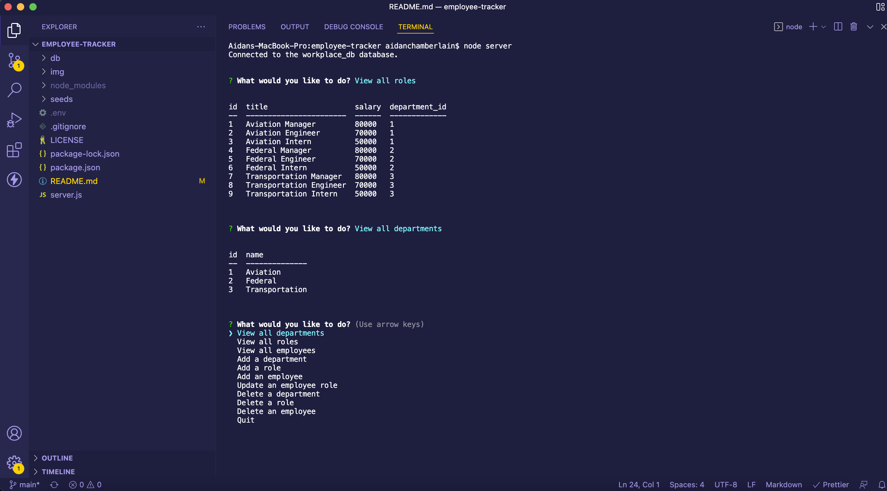

# employee-tracker 

## Table of Contents:

-   [Description](./README.md#description)
-   [Installation](./README.md#installation)
-   [Usage](./README.md#usage)
-   [License](./README.md#license)
-   [Contributing](./README.md#contributing)
-   [Tests](./README.md#tests)
-   [Screenshot](./README.md#screenshot)
-   [Links to Application](./README.md#links-to-application)
-   [Questions](./README.md#questions)

## Description

This is a command line interface app that uses a SQL database to track the workings of a company. When a user starts the application, they are presented with the main menu of executable choices. When the user chooses to view all departments, view all roles, or view all employees, the user is presented a formatted table of the respective information in the console log. When a user chooses to add a department, the user is prompted to enter a department name, and then the information for all departments is displayed. When a user chooses to add a role, the user is prompted to enter a role tile, salary, and which department the role belongs to; the information for all roles is then displayed. When the user chooses to add an employee, the user is prompted to enter first and last name, manager status, and role. If the new employee is a manager, the "manager_id" value will not be passed to the database. The information for all employees is then displayed. When a user chooses to update an employee role, the user is prompted to enter the employee to change, and the new role; the information for all employees is then displayed. When the user chooses to delete a department, the user is prompted to choose a department and then that department is removed from the database and the remaining departments are all displayed. When the user chooses to delete a role, the user is prompted to choose a role and then that role is removed from the database and the remaining roles are all displayed. When the user chooses to delete an employee, the user is prompted to choose an employee and then that employee is removed from the database and the remaining employees are all displayed.

## Installation

If you wish to use this application, you will need to access my GitHub account (RedComet6) and copy the code.

## Usage

To use this application, obtain the code from my GitHub account (RedComet6), and run "node server.js" from the command line terminal.

## License

This software is licensed to MIT, for more information you may visit this link:
[MIT License Wikipedia](https://en.wikipedia.org/wiki/MIT_License)

## Contributing

If you wish to contribute to my content, please contact me at asunshine99@gmail.com.

## Screenshot

## Links to Application

-   Here is the repo: [https://github.com/RedComet6/employee-tracker](https://github.com/RedComet6/employee-tracker)
-   Here is the pages: [https://redcomet6.github.io/employee-tracker/](https://redcomet6.github.io/employee-tracker/)

## Questions

If you have any questions, you may contact:

#### Aidan Chamberlain

Email: asunshine99@gmail.com  
Github Profile: [https://www.github.com/RedComet6](https://www.github.com/RedComet6)
